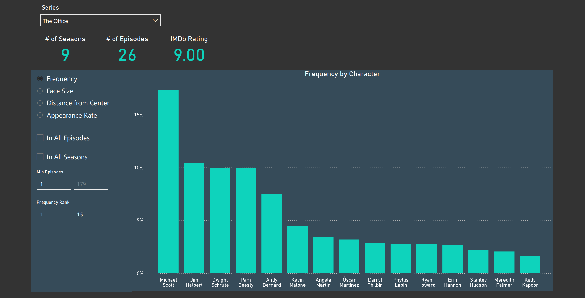

# CineFace

CineFace is an AI-powered toolkit for detecting and identifying faces in film and television content. This project leverages advanced machine learning models to automatically recognize and analyze characters across movies, TV shows, and video clips. If you're only interested in the CineFace dataset, it's available at the bottom.


## Requirements
CineFace relies on [Docker](https://docs.docker.com/get-started/get-docker/) and [Qdrant](). To install Qdrant, just run with Docker. It will download the image automatically
```
docker run -p 6333:6333 qdrant/qdrant
```

## Install
Simply download the source code
```
git clone https://github.com/astaileyyoung/CineFace.git
```

Then install the required dependencies
```
pip install -r requirements.txt
```

Finally, install CineFace
```
pip install -e .
```

CineFace uses Visage as a backend for accurate, high-performance facial detection and encoding. [Visage](https://github.com/astaileyyoung/Visage) can also be used independently.

**Be advised that the associated docker image is quite large (~17GB) since it relies on heavy ML libraries built from source, so it will take a while to download (~10-15 minutes). 


## Usage
Running CineFace is straightforward.

#### **Basic Command**
```
cineface <src> <dst> [options]
```
- `<src>`: Path to the input video file
- `<dst>`: Path to the output file
### **Command-Line Arguments**

| Argument                | Type     | Default                    | Description                                         |
|-------------------------|----------|----------------------------|-----------------------------------------------------|
| `src`                   | str      | (required)                 | Path to input video file or directory.              |
| `dst`                   | str      | (required)                 | Path to output directory or results file.           |
| `imdb_id`               | int      | (required)                 | IMDb ID (just the numbers).                         |
| `--faces_dir`           | str      | `None`                     | Directory to save face images to                    |
| `--encoding_col`        | str      | `'embedding'`              | Column name for face embeddings.                    |
| `--image`               | str      | `'astaileyyoung/visage'`   | Container/image name (for debugging/development).   |
| `--frameskip`           | int      | `24`                       | Number of frames to skip between detections.        |
| `--threshold`, `-t`     | float    | `0.5`                      | Recognition confidence threshold.                   |
| `--timeout`             | int      | `60`                       | Timeout (in seconds) for matching.                  |
| `--batch_size`          | int      | `256`                      | Batch size for matching.                            |
| `--season`              | int      | `None`                     | Season number (required for matching tv show).      |
| `--episode`             | int      | `None`                     | Episode number (requird for matching tv show).      |
| `--qdrant_client`       | str      | `'localhost'`              | Qdrant client address (vector DB).                  |
| `--qdrant_port`         | int      | `6333`                     | Qdrant port.                                        |

**Automatic tv/movie identification by filename is no longer working due to change in the IMDb API that has broken Cinemagoer search, which automatic identification depends on. If analyzing a movie, you must enter the imdb_id. If analyzing a tv show, you must enter the imdb_id, season, and episode.


## Datasets
The dataset can be downloaded [here](https://drive.google.com/file/d/1YO7jiCmMv66vZ18sBkWiJ40v4HrYQYJn/view?usp=sharing). 

The corresponding face encodings can be downloaded [here](https://drive.google.com/file/d/1D-Z5L9VWYcTciMjsyFIAu2ZWY5_amxzG/view?usp=sharing). 
The encodings are saved as .npy files corresponding to either an episode or a movie. The filenames are in the form of {imdb_id}\_{season}\_{episode} The encoded faces are in sequence, so the easiest way to join the encodings to the correct face data is simply to load the appropriate .csv file and add the encodings as a column.

A dashboard is available here to view the data [here.](https://app.powerbi.com/view?r=eyJrIjoiMWE4YzViOWMtY2RiYy00ZTk1LWExNTgtMTg5YjZjNTE2NjIzIiwidCI6ImI3Yzk1YTkyLTBlYWQtNDRlOS04YjgzLTdjMGY5NmNiMDUyMSIsImMiOjF9) 

[](https://app.powerbi.com/view?r=eyJrIjoiMWE4YzViOWMtY2RiYy00ZTk1LWExNTgtMTg5YjZjNTE2NjIzIiwidCI6ImI3Yzk1YTkyLTBlYWQtNDRlOS04YjgzLTdjMGY5NmNiMDUyMSIsImMiOjF9)

The dashboard is still a work in progress. Feel free to submit a ticket if some feature is not working as intended.