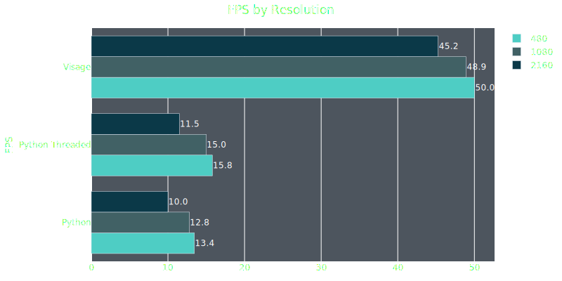

# Visage
A high-performance, GPU-accelerated pipeline for facial detection and recognition in video streams. Built with a FFmpeg/Opencv/TensorRT stack in C++, Visage is optimized to process video at maximum throughput.


## Requirements
- [Docker](https://docs.docker.com/get-docker/) (required)
    - For GPU support, also install the [NVIDIA Container Toolkit](https://docs.nvidia.com/datacenter/cloud-native/container-toolkit/latest/install-guide.html) and the appropriate NVIDIA drivers.


## Install
To get started, just clone the repository
```
git clone https://github.com/astaileyyoung/Visage.git
```
Then install with pip
```
pip install -e .
```
Visage uses docker under the hood, but you can always build from source if you want. However, this is a non-trivial task and would require building and linking the dependencies yourself.

The docker image was build using these libraries:  
Cuda-11.8  
libcudnn8  
OpenCV-4.10     
FFmpeg-4.4  
Video_Codec_SDK_13.0.19  
nv-codec-headers-11.1.5.2  
libtorch-1.12.1  
TensorRT-8.6.1.6  

The setup process also involves copying certain header files (related predominantly to Video_Codec_SDK for HW decoding).
These steps are demonstrated in the accompanying Dockerfile.

## Usage
Running Visage is simple
```
visage <src> [--dst <output>] [--frameskip <N>] [--log_level <LVL>] [--show]
```

### Arguments

| Argument            | Description                                 | Required/Optional | Default Value         |
|---------------------|---------------------------------------------|-------------------|-----------------------|
| `<src>`             | Path to the input video file                | Required          | —                     |
| `--dst <output>`    | Output file path                            | Optional          | —                     |
| `--frameskip <N>`   | Number of frames to skip                    | Optional          | 1                     |
| `--log_level <LVL>` | Logging level                               | Optional          | info                  |
| `--model_dir`       | Location to store cached engines            | Optional          | ~/.visage/models      |
| `--show`            | Show video in window                        | Optional (flag)   | False (not shown)     |

### Example
```
visage /home/amos/videos/MemoriesOfMurder.mkv --dst detection.csv --log_level info --frameskip 24
```

Running visage will automatically download the required docker image and build the TensorRT engines. Be aware that the docker image is quite large (~17GB), so it will take some time to download. Building the TensorRT engines also takes time, but this only happens during the first run. Subsequent runs will use the now existing docker image and the cached engines. 

Visage sometimes has issues when displaying video. If you get the following error
```
Authorization required, but no authorization protocol specifieding video...                  
terminate called after throwing an instance of 'cv::Exception'
  what():  OpenCV(4.12.0-pre) /opencv/modules/highgui/src/window_gtk.cpp:638: error: (-2:Unspecified error) Can't initialize GTK backend in function 'cvInitSystem'
```
Running this command fixes the problem (at least for me)
```
xhost +
```


## Benchmarks
Visage uses a FFmpeg/OpenCV/TensorRT stack for high-performance facial detection and recognition, which offers a large performance boost compared to using Python + DeepFace. 

Detection uses yolov11m-face converted to TensorRT with INT8 precision. Embedding is through a TensorRT-converted Facenet model. 

Code for the benchmarking is in /notebooks. The sample videos used in the benchmarks can also be download from the notebook.

My specs:  
Ubuntu 24.04  
CUDA 12.8  
cuDNN 9.10.1  
Nvidia driver: 570.153.02  
NVIDIA GeForce GTX 1080 TI

#### Detection and embeddings speeds by resolution 



For details on the benchmarking parameters, check out benchmarks.ipynb in notebooks.


## To Do
- Implement optical flow for accurate detection with frameskipping  
- Use threading to boost performance
- Extend batch support to detection
- Add support for additional models
- Integrate real-time identification with Qdrant vector database


## Contributing
Contributions are welcome. If you have ideas for features, improvements, bug fixes, or just want to get involved, please open an issue or pull request.

I am not a professional software developer, so any help—whether it’s code, documentation, testing, or suggestions—is appreciated. If you are new to open source or need guidance, feel free to ask questions in issues.

If you use Visage, we encourage you to share your benchmarking results.
Open a [Benchmark Results Issue](https://github.com/astaileyyoung/Visage/issues/new?template=benchmark-results.yml) using the template and help build a performance database for different GPUs and systems.

You can find the benchmark.py script in /scripts. Simply run the script and it will download the sample videos, perform detection/embedding, and spit out a file with the results. This file can then be uploaded through the aforementioned template.


